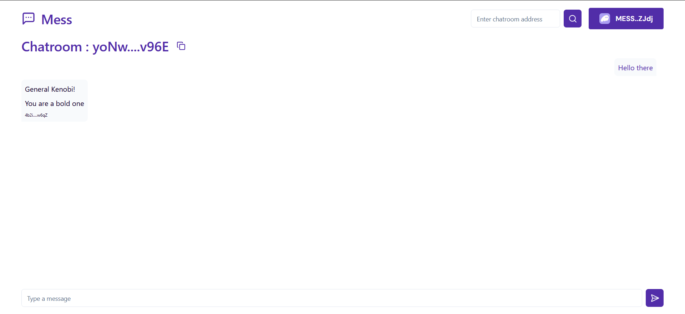

# Mess



Messaging dApp for Solana Curriculum in [freeCodeCampWeb3](https://web3.freecodecamp.org/).

[Live Website](https://chiefwoods.github.io/client-side-app/)

[Program on Solana Explorer](https://explorer.solana.com/address/MESSWwDyEZF9D63ktc12VGEGA6huravzPNJj9gjYFqq?cluster=devnet)

[Source Repository](https://github.com/ChiefWoods/client-side-app)

## Built With

### Languages

- [](https://www.rust-lang.org/)
- [](https://www.typescriptlang.org/)
- [](https://react.dev/)

### Libraries

- [shadcn/ui](https://ui.shadcn.com/)
- [@solana/web3.js](https://solana-labs.github.io/solana-web3.js/)
- [Solana Wallet Adapter](https://github.com/anza-xyz/wallet-adapter)

### Crates

- [anchor-lang](https://docs.rs/anchor-lang/0.30.1/anchor_lang/index.html)

### Test Frameworks

- [](https://mochajs.org/)

## Getting Started

### Prerequisites

1. Update your Solana CLI, npm package and avm to the latest version

```
solana-install update
npm install npm@latest -g
avm update
```

### Setup

1. Clone the repository

```
git clone https://github.com/ChiefWoods/client-side-app.git
```

2. Install all dependencies

```
npm install
```

3. Generate a new keypair

```
solana-keygen-new -o mess-wallet.json
```

4. Set configuration to use devnet and keypair

```
solana config set -u d -k mess-wallet.json
```

5. Airdrop some SOL to account

```
solana airdrop 5
```

6. Resync your program id

```
anchor keys sync
```

7. Build the program

```
anchor build
```

8. Test the program

```
anchor test
```

9. Deploy the program to devnet

```
anchor deploy
```

10. In the `app` directory, create a `.env` file and set its contents

```
VITE_RPC_ENDPOINT=<YOUR_RPC_ENDPOINT>
VITE_MESS_PROGRAM_ID=<YOUR_PROGRAM_ID>
```

11. Start development server

```
npm run dev
```

## Issues

View the [open issues](https://github.com/ChiefWoods/client-side-app/issues) for a full list of proposed features and known bugs.

## Acknowledgements

### Resources

- [Shields.io](https://shields.io/)

### Hosting and API

- [GitHub Pages](https://pages.github.com/)
- [Helius](https://www.helius.dev/)

## Contact

[chii.yuen@hotmail.com](mailto:chii.yuen@hotmail.com)